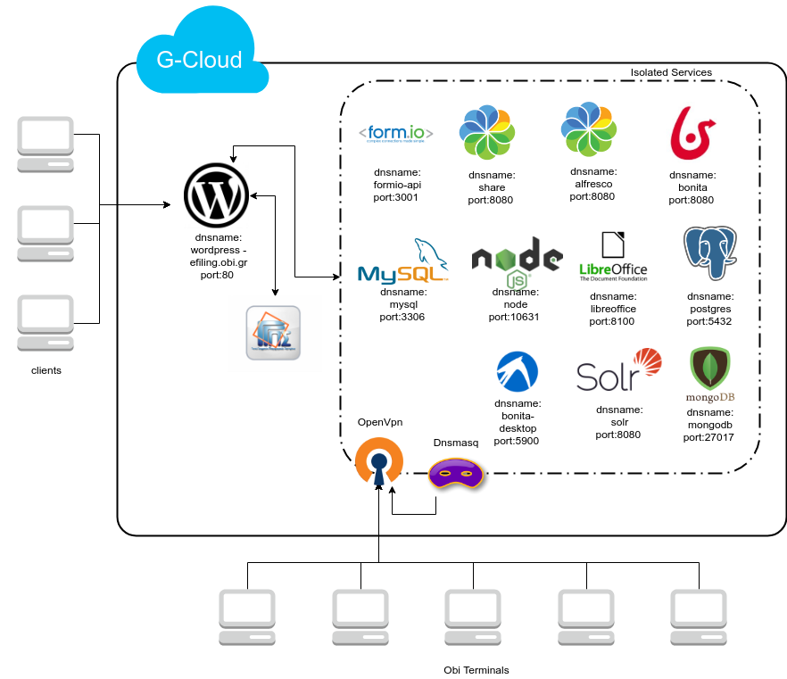

Το σύστημα αποτελείτε από τα  προϊόντα ανοιχτού λογισμικού που αναφέρονται στο διάγραμμα,
στα οποία αποκτά κανείς πρόσβαση μεσώ του εγκατεστημένου ασφαλούς δικτύου VPN

Οι υπηρεσίες στις οποίες ενδέχεται να έχουν πρόσβαση χείριστες του οργανισμού είναι οι:

* Alfresco Share

  http://share:8080/share

και

* Bonita BPM
  http://bonita:8080/bonita

Στο διαδίκτυο με public ip βρίσκονται το website _efiling.obi.gr_ και ο identity server στο _ids.obi.gr_

